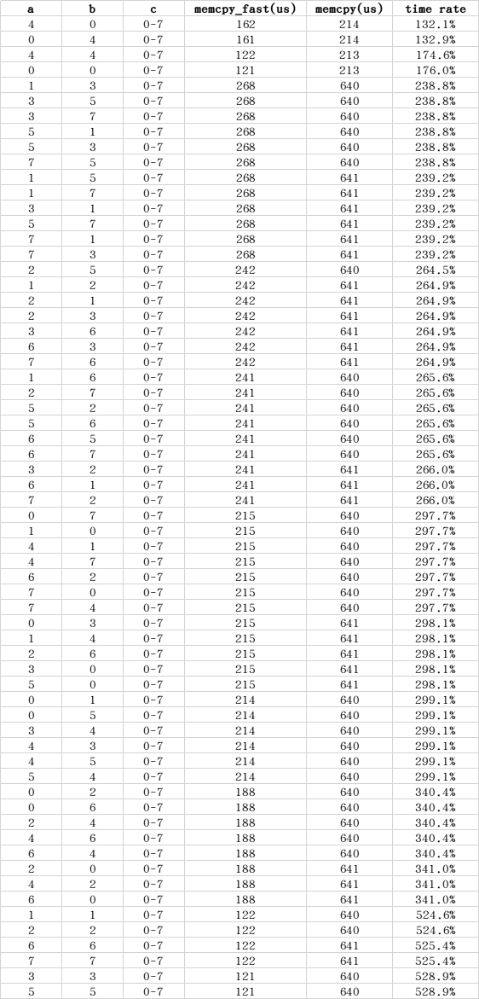

# memcpy_fast
A 1.3 to 5.2 times faster memcpy, optimizing depends on data blocks alignment on Cortex-M4.  

### memcpy_fast vs memcpy
test code: `memcpy_fast(dest + a, src + b, TEST_BUFF_SIZE + c)` and `memcpy(dest + a, src + b, TEST_BUFF_SIZE + c)`  
`dest` and `src` are 8 bytes aligned array variables.  
`TEST_BUFF_SIZE = 10240`  

